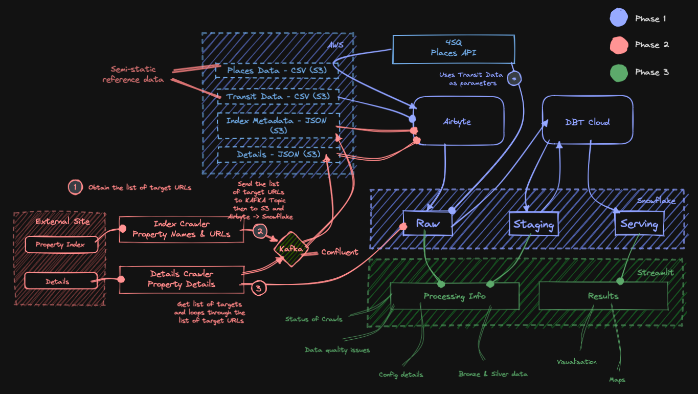

# Property Crawler Pipeline

<br>

## Overview

The PCP (Property Crawler Pipeline) is a combination concepts that forms an almost end to end data extraction pipeline.

The project combines various sources of data such as:

- Places API data from FourSquare
- Bangkok Transit Station data
- Data from a certain Thailand-based property site

The codebase have been split up into several components:

- dbt, the dbt files needed to run the raw, staging and serving transformations
- places-extractor, the script used to query the FourSquare Developer APIs with (currently) the transit coordinates
- property-extractor, the script used to scrape the list of viable data to be used by the details-extractor
- details-extractor, the main page crawler script that extracts data and acts as the primary producer for Confluent
- streamlit - the data visualisation and simple exploration arm of the project

<br>

## Reference Architecture

<br>



<br>

The PCP currently employs various tools such as:

- Beautiful Soup 4 as the crawler engine
- FourSquare API the source for places information
- Kafka (Confluent) as event-driven microservices tool
- Airbyte (Cloud) as the S3 to Snowflake data replication tool
- Snowflake as the data warehouse
- dbt as the data transformation tool
- AWS (S3) as the file / export repository
- and Streamlit as dashboard

<br>

# Get started

## Code

Clone the repository

``` git clone https://github.com/tanhtra/pipeline-places-property.git ```

<br>

## dbt

- Sign up to [dbt cloud](https://www.getdbt.com/)
- Initialise dbt cloud using the [dbt_project.yml](https://github.com/tanhtra/pipeline-places-property/blob/main/dbt_project.yml)

<br>

## Confluent (Kafka)

- Sign up to [Confluent](https://confluent.cloud/)
- Create a new cluster and generate API keys for them
- Create a two new topics to hold the crawled data, in this example:
    - ```index_meta```
    - ```property_details```
- Generate an S3 sink to consume the two topics and drop the payload into S3 as JSON files
- Create/modify two ```kafka.config``` files with your Confluent details and place them in 
    - ```places/extractor/src``` 
    - ```property-extractor/src```

```
# Required connection configs for Kafka producer, consumer, and admin

# bootstrap server - do not include the protocol e.g. pkc-2396y.us-east-1.aws.confluent.cloud:8443
bootstrap.servers=<CONFLUENT BOOTSTRAP SERVER>

security.protocol=SASL_SSL
sasl.mechanisms=PLAIN

# username for kafka
sasl.username=<CONFLUENT USERNAME>

# password for kafka
sasl.password=<CONFLUENT PASSWORD>
compression.type=lz4
batch.size=10000
request.timeout.ms=120000
queue.buffering.max.messages=200000
```
<br>

## AWS S3

- Sign up to [AWS](https://aws.amazon.com/) and create a bucket - using the same region as your Confluent cluster
- Create an access key for the ```.env``` file
- Create a new IAM user with S3 admin access to the bucket(s) involved

<br>

## Airbyte

- Sign up to [Airbyte cloud](https://airbyte.com/)
- Set up Snowflake destination
- Set up S3 source(s) for the Transit (CSV), Places (CSV), Index (JSON) and Property details (JSON) files 
- Create Connection(s)

<br>

## Foursquare

- Sign up to [Foursquare developer programme](https://foursquare.com/developers/)
- Generate API key for places extractor

<br>

## Setup .env file

- Rename the ```template.env``` file to ```.env```
- Replace the tags inside the file with your snowflake and Foursquare API details

```
places_api_key=<FILL WITH PLACES API KEY>

aws_access_key=<AWS S3 BUCKET ACCESS KEY>
aws_secret_key=<AWS S3 BUCKET SECRET KEY>

snowflake_host=<XXX>.snowflakecomputing.com
snowflake_user=<USERNAME>
snowflake_password=<USER PASSWORD>
snowflake_account=<XXX>
snowflake_warehouse=<WAREHOUSE NAME>
snowflake_database=<DATABASE NAME>
snowflake_schema=<DATABASE SCHEMA>
```

<br>

# Running the project

## Running the Places-Extractor

This section will read the Transit CSV data and generate API function calls and generate the CSV files

- Go to the ```places-extractor``` folder
- Run the ```set_python_path.sh```
- Run ``` python places-extract.py ```

<br>

## Running the Property-Extractor

This section can crawl the targeted site to generate a list of properties then generate and upload the JSON payload.

- Go to the ```property-extractor``` folder
- Run the ```set_python_path.sh```
- Run ``` python producer.py -f kafka.config -t index_meta ```
- After the crawl is finished, go to Airbyte and trigger the ingestion of data to extract the generated JSON files from S3 to Snowflake

<br>

## Running the Details-Extractor

This section can crawl the list of properties then generate and upload the JSON payload.

- Go to the ```details-extractor``` folder
- Run the ```set_python_path.sh```
- Run ``` python producer-details.py -f kafka.config -t property-details ```
- After the crawl is finished, go to Airbyte and trigger the ingestion of data to extract the generated JSON files from S3 to Snowflake

<br>

## Running dbt

- Go to Airbyte cloud
- Initialise the details required to connect to Snowflake and AWS S3
- Run ```dbt build``` to generate the ```SERVING``` and ```STAGING``` tables from the ```RAW``` tables generated by the previous steps

<br>

## Running Streamlit

- Go to ```streamlit/.streamlit``` folder
- Create a ```secrets.toml``` file in the ```.streamlit``` folder
- Fill the file with the values below

````
[snowflake]
host = "<SNOWFLAKE HOST>"
user = "<SNOWFLAKE USER>"
password = "<SNOWFLAKE USER PASSWORD>"
account = "<SNOWFLAKE ACCOUNT ID>"
warehouse = "<WAREHOUSE NAME>"
database = "<DATABASE NAME>"
schema = "<SCHEMA NAME>"
````

- Go to ```streamlit/```
- In terminal run ```streamlit run process.py``` to launch the raw-staging dashboard
- In terminal run ```streamlit run serving.py``` to launch the serving dashboard

<br>

### Primary contributor
<hr>
[tanhtra](https://github.com/tanhtra)